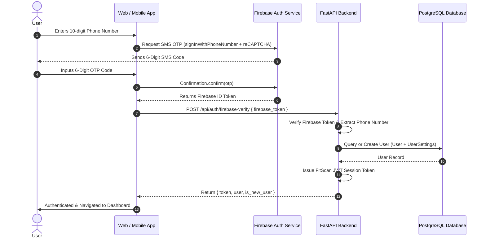

# Firebase Phone OTP Authentication Architecture

This document details the design, workflow, and implementation of the **Firebase Phone OTP Authentication** system for FitScan across the FastAPI backend, Next.js web frontend, and React Native mobile application.

---

## 1. System Overview & Architecture

FitScan uses a hybrid authentication model combining **Firebase Phone Authentication** (for secure, global SMS delivery) with a **Custom FastAPI JWT Session System** (for seamless database user management).



---

## 2. Dual-Mode Authentication Flow

To allow seamless development without burning Firebase SMS quota while supporting production SMS, the system runs in two modes:

### A. Production Mode (Firebase Phone Auth)
- **Firebase Project**: `fitscan-54e95` (Blaze Plan enabled for SMS).
- **Web Client**: Uses `RecaptchaVerifier` for reCAPTCHA validation and `signInWithPhoneNumber()` to trigger SMS.
- **Verification**: On successful SMS verification, Firebase returns a signed **Firebase ID Token**.
- **Backend Handshake**: The client sends the ID token to `POST /api/auth/firebase-verify`. The backend decodes the token, extracts the verified `phone_number` claim, and provisions the database user.

### B. Local Development Fallback Mode
- Active when Firebase credentials are omitted or during local dev testing.
- **Endpoint**: `POST /api/auth/send-otp` and `POST /api/auth/verify-otp`.
- **Dev OTP**: In dev mode, a static override code `123456` or an in-memory generated 6-digit code is used.

---

## 3. Backend Endpoints & Logic

### 1. `POST /api/auth/firebase-verify`
- **Request Body**:
  ```json
  {
    "firebase_token": "eyJhbGciOiJSUzI1NiIs...",
    "phone": "+919876543210",
    "name": "User Name (Optional)"
  }
  ```
- **Handler**: `firebase_verify_endpoint` in `app/routers/auth.py`.
- **Process**:
  1. Decodes and verifies the Firebase ID token (`verify_firebase_id_token`).
  2. Resolves phone number in E.164 format (`+91XXXXXXXXXX`).
  3. Invokes `get_or_create_user(db, phone, name)`:
     - Checks if phone number exists in `users` table.
     - If **existing**: updates `last_login` timestamp.
     - If **new user**: creates new `User` record + default `UserSettings` record (Calorie Goal: 2000 kcal, Macros: P: 150g, C: 200g, F: 65g).
  4. Generates a signed **FitScan JWT Access Token** valid for 30 days.

### 2. `POST /api/auth/send-otp` & `POST /api/auth/verify-otp`
- Used for local API testing and non-Firebase fallback.

---

## 4. Database User Provisioning Schema

When a user logs in for the first time via OTP:

1. **`users` Table**:
   - `id`: Primary key integer.
   - `phone`: Unique phone number (`+919876543210`).
   - `name`: User display name (collected during onboarding).
   - `created_at` / `last_login`: UTC timestamps.

2. **`user_settings` Table** (Auto-created on signup):
   - Defaults: `calorie_goal`: 2000, `protein_goal`: 150g, `carbs_goal`: 200g, `fat_goal`: 65g.
   - Profile: `goal_type`: `"fat_loss"`, `diet_type`: `"veg"`, `budget_tier`: `"moderate"`.

---

## 5. Client Integration Key Features

### 10-Digit Phone Normalization (`cleanPhoneNumber`)
Both Web and Mobile clients normalize user input before validation:
- Strips any accidental spaces, dashes, or country code prefix (`+91` or `91`).
- Ensures exactly 10 national digits are entered before enabling the "Send OTP" button.
- Format passed to API: `+91${cleanPhone}` (E.164 international format).

### Cross-Platform Session Persistence
- **Web (Next.js)**: JWT token stored in `localStorage` under `fitscan_token`.
- **Mobile (React Native)**: JWT token stored in `@react-native-async-storage/async-storage` under `fitscan_token`.
- Backend endpoints authenticate incoming requests using `Authorization: Bearer <fitscan_token>`.

---

## 6. Environment Configuration

### Backend `.env`
```env
JWT_SECRET=your_jwt_secret_key_here
JWT_ALGORITHM=HS256
JWT_EXPIRY_HOURS=720
DEV_OTP=123456
```

### Frontend `.env.local`
```env
NEXT_PUBLIC_FIREBASE_API_KEY=AIzaSy...
NEXT_PUBLIC_FIREBASE_AUTH_DOMAIN=fitscan-54e95.firebaseapp.com
NEXT_PUBLIC_FIREBASE_PROJECT_ID=fitscan-54e95
```
