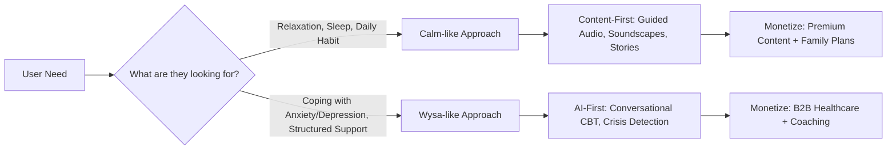

# Calm vs Wysa — Comprehensive Comparison (July 2026)

## 1. At a Glance

| Dimension | **Calm** | **Wysa** |
|:---|:---|:---|
| **Founded** | 2012 (San Francisco, USA) | 2016 (Bengaluru, India / Boston, USA) |
| **Core Identity** | Mindfulness & Sleep Media Suite | AI-Powered Behavioral Therapy Chatbot |
| **Approach** | Passive — consume curated audio/video content | Active — conversational AI guides users through exercises |
| **Therapeutic Model** | General wellness & relaxation | Evidence-based CBT, DBT, mindfulness |
| **Valuation** | ~$2 Billion (2026) | ~$250–300 Million (estimated) |
| **Total Downloads** | 180M+ lifetime | 10M+ lifetime |
| **Paid Subscribers** | ~3.5–5M | Not publicly disclosed |

---

## 2. Feature Comparison

| Feature | **Calm** | **Wysa** |
|:---|:---|:---|
| Guided Meditation | ✅ Extensive library (beginner → advanced) | ✅ Available, but secondary to chatbot |
| AI Chatbot | ❌ None | ✅ Core feature — 24/7 conversational AI |
| Sleep Stories | ✅ Celebrity-narrated (McConaughey, Stephen Fry, Bob Ross) | ❌ Not a focus |
| CBT/DBT Exercises | ❌ Not offered | ✅ 150+ interactive evidence-based exercises |
| Breathwork | ✅ Guided breathing exercises | ✅ Breathing exercises included |
| Soundscapes / White Noise | ✅ Rich library (nature, brown noise, bilateral stimulation) | ⚠️ Limited |
| Human Coaching | ❌ Not available | ✅ Optional text-based sessions with professionals |
| Mindful Movement (Yoga/Tai Chi) | ✅ Video/audio sessions | ❌ Not a focus |
| Masterclasses | ✅ Expert-taught wellness content | ❌ Not available |
| Mood / Habit Tracking | ✅ Streaks, minutes, mood patterns | ✅ Mood tracking integrated |
| Crisis Detection | ❌ Not built-in | ✅ Recognizes concerning language → redirects to helplines |
| EHR Integration | ❌ Not applicable | ✅ Wysa Gateway — integrates with healthcare systems |
| Multi-language Support | ⚠️ Limited | ✅ Hindi, Spanish, and more |
| Anonymity | ⚠️ Account required | ✅ Fully anonymous usage possible |

---

## 3. Pricing

### Calm
| Plan | Price |
|:---|:---|
| Free | Limited meditations, 1 breathing exercise, rotating Sleep Stories |
| Monthly | ~$14.99–$16.99/month |
| Annual | ~$69.99–$79.99/year |
| Family (up to 6) | ~$99.99/year |
| Lifetime | ~$399.99–$499.99 (one-time) |
| Free Trial | 7-day trial for premium |

### Wysa
| Plan | Price |
|:---|:---|
| Free | AI chatbot + basic mindfulness exercises |
| Premium Self-Care | ~$74.99/year (full exercise library) |
| Premium Plus (Coaching) | ~$99.99/month or ~$19.99+/session |
| Wysa for Teams | ~$50/employee/year |

> [!TIP]
> **Value Insight**: Wysa's annual premium ($74.99) is comparable to Calm's ($69.99–$79.99), but Wysa adds CBT/DBT tools + AI chat. Calm's value lies in the breadth of premium content (Sleep Stories, soundscapes, masterclasses).

---

## 4. Target Audience

### Calm — The Wellness Consumer
- **Demographics**: Ages 18–44, working professionals, busy adults
- **Motivation**: Sleep improvement (~72% cite this), daily stress unwinding, meditation habit
- **Persona**: Someone who wants a **nightly wind-down ritual** or a **daily mindfulness habit** without clinical depth
- **Market**: Premium lifestyle/wellness brand

### Wysa — The Clinical & Accessibility-Focused User
- **Demographics**: Broader range, skewing toward younger adults; those priced out of therapy or in provider-shortage areas
- **Motivation**: Managing anxiety spirals, depression, actionable coping strategies, anonymous support
- **Persona**: Someone who needs **structured in-the-moment support** for specific mental health symptoms
- **Market**: Bridge between self-help and professional therapy; increasingly B2B/healthcare

---

## 5. Clinical Evidence & Credibility

| Aspect | **Calm** | **Wysa** |
|:---|:---|:---|
| **FDA Status** | None | ✅ FDA Breakthrough Device Designation (for chronic pain + depression/anxiety) |
| **Peer-Reviewed Studies** | Some general wellness studies | 36+ peer-reviewed publications |
| **Research Partners** | — | Cambridge, Harvard, Washington University |
| **Clinical Positioning** | Wellness & lifestyle tool | Evidence-based digital therapeutic |
| **Disclaimer** | Not a substitute for therapy | Not a substitute for crisis services, but clinically validated |

> [!IMPORTANT]
> Wysa's FDA Breakthrough Device Designation is **not** blanket approval — it specifically covers AI-based CBT for chronic musculoskeletal pain with associated depression/anxiety. Still, it signals strong clinical credibility.

---

## 6. Business Model & Market Position

### Calm
- **Revenue (2025)**: ~$210M (↓24% YoY)
- **ARR (2026)**: ~$300–550M (including enterprise)
- **Strategy Pivot**: Moving from pure DTC → **Calm Business** (employer wellness) + **Calm Health** (healthcare partnerships)
- **New Products**: Calm Sleep app (Sept 2025), international Calm Health rollout (UK, Canada)
- **Strengths**: Category leader brand, celebrity content, massive user base

### Wysa
- **Revenue**: Not publicly disclosed; estimated in the tens of millions
- **Strategy**: B2B-first — corporate wellness programs, healthcare system integrations
- **Key Product**: Wysa Gateway (automates clinical screenings, EHR integration)
- **Strengths**: Clinical validation, AI-first, global accessibility, enterprise healthcare play

---

## 7. Strengths & Weaknesses

### Calm
| Strengths | Weaknesses |
|:---|:---|
| 🏆 Market leader brand recognition | ❌ No AI/chatbot — purely content-driven |
| 🎧 Premium production quality & celebrity narrators | ❌ No clinical depth (CBT/DBT) |
| 🌙 Best-in-class sleep content | ❌ Consumer downloads declining post-pandemic |
| 👨‍👩‍👧‍👦 Family plan available | ❌ Higher price barrier for casual users |
| 🏢 Growing enterprise (Calm Business) | ❌ No crisis detection |

### Wysa
| Strengths | Weaknesses |
|:---|:---|
| 🤖 24/7 AI chatbot — always available | ❌ Smaller brand awareness vs Calm/Headspace |
| 🧠 Evidence-based CBT/DBT exercises | ❌ Content library less polished/premium feeling |
| 🔒 Fully anonymous usage | ❌ Premium Plus coaching is expensive ($99/mo) |
| 🏥 FDA Breakthrough Device Designation | ❌ No celebrity content or Sleep Stories |
| 🌍 Multi-language, global accessibility | ❌ Fewer entertainment/lifestyle features |
| 👨‍⚕️ Optional human coaching | |

---

## 8. Key Takeaways for Your Wellness Project

### Summary
| If you want to build... | Learn from... |
|:---|:---|
| A relaxation/meditation app with rich media | **Calm** — content quality, sleep focus, celebrity partnerships |
| An AI-driven mental health support tool | **Wysa** — CBT chatbot, clinical validation, crisis safety |
| An enterprise/B2B wellness solution | **Both** — Calm Business model + Wysa for Teams/Gateway |
| An accessible, global-first wellness app | **Wysa** — anonymous usage, multi-language, lower barriers |

> [!NOTE]
> The market is moving toward **hybrid models** — combining content-based relaxation (Calm-style) with AI-driven therapeutic support (Wysa-style). For your wellness project, consider which end of this spectrum serves your target users best, or whether a hybrid approach makes sense.
